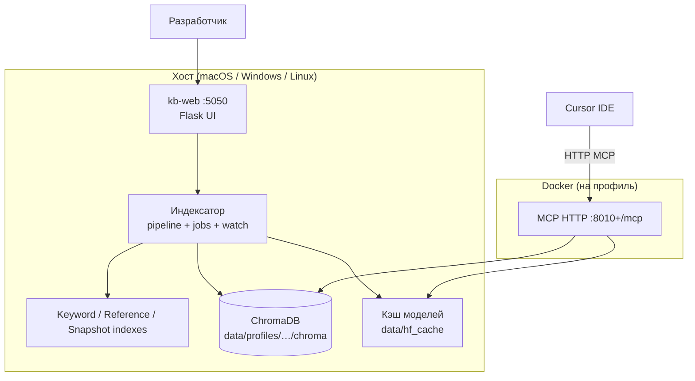

# project-kb-mcp — описание, область применения и внедрение

**Версия документа:** 1.4.0  
**Дата:** июнь 2026  
**Репозиторий:** универсальный Python-проект для векторной базы знаний конфигураций 1С с MCP-сервером для Cursor.

> Для передачи другому агенту / разработчику: [AGENT_HANDOFF.md](./AGENT_HANDOFF.md)

---

## Содержание

1. [Кратко](#кратко)
2. [Область применения](#область-применения)
3. [Что решает и чем не является](#что-решает-и-чем-не-является)
4. [Архитектура](#архитектура)
5. [Ключевая модель: профиль](#ключевая-модель-профиль)
6. [Источники данных и индексация](#источники-данных-и-индексация)
7. [Инкрементальная индексация и команда](#инкрементальная-индексация-и-команда)
8. [MCP-инструменты для Cursor](#mcp-инструменты-для-cursor)
9. [Расширенные возможности (10 фич)](#расширенные-возможности-10-фич)
10. [Структура проекта](#структура-проекта)
11. [Жизненный цикл (4 шага)](#жизненный-цикл-4-шага)
12. [Docker и Cursor](#docker-и-cursor)
13. [Требования и масштаб](#требования-и-масштаб)
14. [Внедрение в другой проект](#внедрение-в-другой-проект)
15. [Конфигурация профиля](#конфигурация-профиля)
16. [CLI и API](#cli-и-api)
17. [Расширение и кастомизация](#расширение-и-кастомизация)
18. [Ограничения](#ограничения)
19. [Чек-лист внедрения](#чек-лист-внедрения)

---

## Кратко

**project-kb-mcp** — локальная система, которая:

1. Сканирует исходники конфигурации 1С (EDT или XML-выгрузка).
2. Разбивает метаданные, BSL-код и опционально markdown-документацию на чанки.
3. Строит векторные эмбеддинги и сохраняет их в **ChromaDB**.
4. Строит вспомогательные индексы: keyword (гибридный поиск), references (ссылки в BSL), metadata snapshot (сравнение профилей).
5. Отдаёт семантический и гибридный поиск через **MCP-сервер** (HTTP) в **Cursor IDE**.
6. Управляется через **веб-интерфейс** (Flask): профили, индексация, watch, health, Docker, слияние `mcp.json`.

Один профиль = одна конфигурация 1С = одна коллекция Chroma = один MCP-сервер = один HTTP-порт.

**Разделение ответственности:** тяжёлая индексация, watch и GPU-эмбеддинги — на **хосте**. Docker-контейнер MCP — только **чтение** Chroma и обслуживание tools (CPU).

---

## Область применения

### Подходит для

| Сценарий | Как помогает |
|----------|--------------|
| **Разработка на EDT** | Поиск по объектам, модулям, подсистемам своей конфигурации |
| **Работа с XML-выгрузкой** | Индексация выгруженной конфигурации без EDT |
| **Крупные типовые базы** (БП 3.0, ЗУП, ERP и т.п.) | Семантический поиск по ~200–250k чанков; keyword/reference индексы при индексации |
| **Несколько конфигураций параллельно** | Отдельный профиль, порт и Docker Compose на каждую |
| **Сравнение веток/релизов** | Клон профиля + compare по metadata snapshot |
| **Передача индекса команде** | Export/import `.tar.gz` с проверкой schema_version и embedding_dim |
| **Cursor + локальный AI** | MCP даёт агенту контекст из *вашего* проекта |

### Типичные задачи в Cursor

- «Где в конфигурации реализовано проведение документа X?»
- «Найди все ссылки на процедуру `Проведение`» → `find_references`
- «Какие регистры затрагивает объект Y?» → `get_register_movements`
- «Какие объекты входят в подсистему УправлениеЗапасами?» → `search_by_subsystem`
- «Покажи BSL-модули документа Z» → `list_object_modules`

---

## Что решает и чем не является

### Решает

- **Контекст проекта для LLM** — агент Cursor видит структуру и код *вашей* конфигурации.
- **Гибридный поиск** — семантика + точные идентификаторы (keyword index).
- **Авто-обновление индекса** — watch с persist в config.yaml.
- **Изоляция баз** — отдельные профили, коллекции, порты.
- **Повторяемое развёртывание** — профили в YAML, Docker Compose, export/import.

### Не является

- Справкой по **встроенному языку платформы 1С** → `1c-syntax-helper`.
- Production runtime — dev-time инструмент для разработчика.

### Связка с другими MCP

```
Cursor IDE
├── 1c-syntax-helper   → синтаксис платформы
├── 1c-kb-<профиль>    → код и метаданные ВАШЕЙ конфигурации  ← этот проект
└── searxng            → веб-поиск (опционально)
```

---

## Архитектура



| Компонент | Где работает | Задача |
|-----------|--------------|--------|
| **kb-web** | Хост | UI, jobs, watch, health, Docker, mcp.json |
| **indexer/** | Хост | Сканирование, чанкинг, эмбеддинги, вспомогательные индексы |
| **mcp_server/** | Docker (или хост) | Только чтение Chroma + 8 MCP tools |
| **ChromaDB** | Volume на хосте | Векторное хранилище |

---

## Ключевая модель: профиль

```
profiles/<имя>/config.yaml          ← настройки (watch, search, include_forms)
data/profiles/<имя>/chroma/         ← ChromaDB
data/profiles/<имя>/indexes/        ← keyword, references
data/profiles/<имя>/metadata-snapshot.json
~/DockerMCP/1c-kb-<имя>/            ← compose-проект
~/.cursor/mcp.json                  ← запись MCP
```

---

## Источники данных и индексация

### Поддерживаемые форматы

| Формат | `project.format` | Корень |
|--------|------------------|--------|
| **EDT** | `edt` | Корень EDT, исходники в `src/` |
| **XML-выгрузка** | `xml_export` | Каталог выгрузки |

### Что индексируется

- Метаданные объектов (документы, справочники, регистры и др.)
- BSL-модули: `ObjectModule.bsl`, `ManagerModule.bsl`, `Module.bsl`, `FormModule.bsl` и др.
- Подсистемы, опционально `docs/`

### include_forms (XML-выгрузка)

При `indexing.include_forms: true`:

- Снимается exclude `**/Forms/**/*.xml`
- Индексируются XML метаданные форм (`Documents/X/Forms/Y/…`)
- Индексируются BSL в `Forms/` (`Module.bsl`, `FormModule.bsl`)

При `false` (по умолчанию) — формы полностью исключены.

**Важно:** смена `include_forms` требует полной переиндексации.

### Пайплайн индексации

```
scan → extract → chunk → embed → upsert (Chroma)
  └→ build keyword index, reference index, metadata snapshot
```

Фазы прогресса: `scanning` → `chunking` → `embedding` → `upserting` → `finalizing`.

---

## Инкрементальная индексация и команда

| Режим | Когда |
|-------|-------|
| **Полная** (`--full`) | Первый запуск, смена модели, смена include_forms |
| **Инкрементальная** (`--incremental`) | После правок исходников |
| **Watch** | Авто-инкремент при изменении файлов (persist в config) |

Источник изменений: локальный `index-manifest.json` ± git status.

### Watch (авто-инкремент)

- Polling через лёгкий preview **без** `count_chunks` на каждом цикле
- Debounce перед запуском job (настраивается в `watch.debounce_sec`)
- Состояние `watch.enabled` сохраняется в `config.yaml`
- Восстанавливается при рестарте `kb-web`
- Лог: `data/profiles/<имя>/watch.log`
- При активной индексации изменения ставятся в очередь (`pending_changes`)

---

## MCP-инструменты для Cursor

Сервер регистрирует **8 инструментов** (`mcp_server/server.py`):

| Tool | Назначение |
|------|------------|
| `search_project` | Гибридный (по умолчанию) или векторный поиск; `hybrid: bool`, `object_type` |
| `get_object` | Карточка объекта метаданных |
| `get_module_summary` | Сводка BSL-модуля: экспортные процедуры |
| `list_subsystems` | Список подсистем и состав |
| `find_references` | Ссылки на идентификатор в BSL (через reference index) |
| `list_object_modules` | BSL-модули объекта метаданных |
| `search_by_subsystem` | Объекты подсистемы |
| `get_register_movements` | Движения по регистрам (structured metadata) |

Транспорт в Docker: **streamable-http**, endpoint `/mcp`.

Пример `~/.cursor/mcp.json`:

```json
{
  "mcpServers": {
    "1c-kb-myproject": {
      "url": "http://127.0.0.1:8010/mcp"
    }
  }
}
```

### Примеры запросов агенту

- «Используй `search_project` с запросом "проведение документа реализация"»
- «Вызови `find_references` для идентификатора `ЗаполнитьТабличнуюЧасть`»
- «Покажи `get_register_movements` для Document.РеализацияТоваровУслуг»

---

## Расширенные возможности (10 фич)

| # | Фича | Кратко |
|---|------|--------|
| 1 | **Прогресс** | Фазы job, chunks, ETA, SSE, cancel, persist `last-job.json`, checkpoint/resume (CLI + кнопка «Продолжить») |
| 2 | **Watch** | Авто-инкремент, persist, light poll, restore при старте kb-web |
| 3 | **Гибридный поиск** | Vector + keyword (build-time index), веса в `search.*` |
| 4 | **8 MCP tools** | find_references, list_object_modules, search_by_subsystem и др. |
| 5 | **Export/Import** | `.tar.gz`, schema_version, проверка embedding_dim, path traversal protection |
| 6 | **Compare/Clone** | Metadata + BSL diff, `clone_profile(copy_index=True)`, git_branch в meta |
| 7 | **GPU/Embeddings** | device: auto/cpu/cuda/mps, предупреждение о переиндексации при смене модели |
| 8 | **include_forms** | XML и EDT формы (`Form.form`, CommonForms, Module.bsl) — см. [EDT_FORMS_AUDIT.md](./EDT_FORMS_AUDIT.md) |
| 9 | **Health** | Drill-down таблица проверок; состояния new/indexing/ready/degraded |
| 10 | **Wizard** | 5 шагов: путь → анализ → настройки → профиль → индекс |

---

## Структура проекта

```
project-kb-mcp/
├── indexer/
│   ├── config.py              # ProfileConfig, watch, search, include_forms
│   ├── scanner.py             # EDT/XML, include_forms
│   ├── pipeline.py            # kb-index, build indexes
│   ├── jobs.py                # Фоновые задачи + progress
│   ├── checkpoint.py          # Resume полной индексации
│   ├── progress.py            # Фазы, ETA, chunks
│   ├── watcher.py             # Watch persist + restore
│   ├── hybrid_search.py       # Vector + keyword
│   ├── keyword_index.py       # Build-time keyword index
│   ├── reference_index.py     # Build-time BSL references
│   ├── metadata_snapshot.py   # Snapshot для compare
│   ├── index_archive.py       # Export/import tar.gz
│   ├── profile_compare.py     # Compare profiles
│   ├── health.py              # Health dashboard
│   ├── wizard.py              # Onboarding preview
│   ├── api_errors.py          # Единый формат API-ошибок
│   ├── exceptions.py          # Иерархия исключений
│   └── …
├── mcp_server/server.py       # 8 MCP tools
├── web/                       # Flask UI :5050
├── profiles/_template/        # Шаблон config.yaml
├── data/profiles/<имя>/       # chroma, indexes, manifest, watch.log
├── tests/                     # 53+ автотестов
└── docs/
```

### Точки входа

| Команда | Назначение |
|---------|------------|
| `kb-web` | Веб-интерфейс |
| `kb-index` | Индексация CLI |
| `kb-mcp` | MCP-сервер |

---

## Жизненный цикл (4 шага)

| # | Шаг | Критерий |
|---|-----|----------|
| 1 | Индексация | chunks > 0, нет failed job |
| 2 | Образ Docker | `1c-kb-mcp:latest` |
| 3 | Контейнер | compose up, MCP отвечает |
| 4 | Cursor MCP | mcp.json + tools loaded |

### Порядок для нового профиля

1. `kb-web` → мастер onboarding или «Новый профиль»
2. Полная индексация (прогресс с фазами в UI)
3. Docker: собрать образ → запустить контейнер
4. mcp.json → Cursor Settings → MCP
5. Опционально: включить Watch для авто-инкремента

---

## Docker и Cursor

Каждый MCP — отдельная compose-директория (`~/DockerMCP/1c-kb-<имя>/`).

Volumes монтируют `data/` и `profiles/` с хоста — индексация в контейнере **не выполняется**.

GPU ускоряет индексацию на **хосте**; MCP в Docker использует CPU для embed query (если не запущен на хосте).

---

## Требования и масштаб

- Python **3.11+**, Docker Desktop
- **8–16 GB RAM** для крупных баз
- БП 3.0 (~200–250k чанков): **2–6 ч** индексации на CPU

| Сервис | Порт |
|--------|------|
| kb-web | 5050 |
| MCP профиля N | 8010 + N |

---

## Внедрение в другой проект

Рекомендуется отдельный репозиторий `project-kb-mcp`; проекты 1С ссылаются путями в профилях.

Перенос индекса: export на машине A → import на машине B → docker start → mcp.json.

---

## Конфигурация профиля

```yaml
profile:
  name: myproject
  display_name: "ERP Клиент"

project:
  format: edt              # edt | xml_export
  root: /abs/path/to/edt
  src: src

indexing:
  include_dirs: []
  exclude_dirs: []
  exclude_globs: []
  include_forms: false     # true — XML-формы и Form BSL

watch:
  enabled: false
  poll_interval_sec: 2
  debounce_sec: 3

search:
  hybrid: true
  vector_weight: 0.65
  keyword_weight: 0.35

docs:
  enabled: true
  paths: [docs]

embeddings:
  provider: local
  model: intfloat/multilingual-e5-small
  batch_size: 128
  device: auto             # auto | cpu | cuda | mps

store:
  path: data/profiles/myproject/chroma
  collection: myproject

mcp:
  server_name: 1c-kb-myproject
  transport: http
  host: "0.0.0.0"
  port: 8010
```

### Создание профиля

```python
from indexer.profile_ops import create_profile

create_profile(
    name="myproject",
    display_name="ERP",
    fmt="xml_export",
    root="/path/to/xml",
    include_forms=True,
    docs_enabled=False,
)
```

---

## CLI и API

### CLI

```bash
kb-web
kb-index --profile myproject --full
kb-index --profile myproject --incremental
kb-index --profile myproject --preview-changes
kb-index --profile myproject --export /path/backup.tar.gz
kb-index --profile myproject --import /path/backup.tar.gz --overwrite
kb-index --profile myproject --full --resume --progress
python scripts/benchmark_search.py --profile myproject
kb-mcp --profile myproject --transport http --port 8010
```

Checkpoint при полной индексации: `data/profiles/<имя>/index-checkpoint.json`.  
`--resume` продолжает с последнего файла; `--progress` включает tqdm (пакет `cli`).

### HTTP API (kb-web)

| Метод | Путь | Описание |
|-------|------|----------|
| GET | `/api/health` | Системная диагностика |
| GET | `/api/profiles/<name>/health` | Health профиля (state: new/indexing/ready/degraded) |
| POST | `/api/wizard/preview` | Wizard: detect + preview + estimate |
| POST | `/api/wizard/embeddings/check` | Wizard: проверка embeddings (local/openai) |
| POST | `/api/profiles` | Создать профиль (`include_forms`) |
| GET | `/api/profiles/<name>/index/changes` | Preview изменений |
| POST | `/api/profiles/<name>/index` | Полная / инкрементальная / resume (`{"resume": true}`) |
| GET | `/api/profiles/<name>/checkpoint` | Незавершённая полная индексация |
| DELETE | `/api/profiles/<name>/checkpoint` | Сброс checkpoint |
| GET | `/api/jobs/<id>` | Статус job + `progress` (фазы, ETA) |
| GET | `/api/jobs/<id>/stream` | SSE-поток прогресса |
| POST | `/api/jobs/<id>/cancel` | Отмена индексации |
| POST | `/api/profiles/compare/export` | Экспорт сравнения JSON/CSV |
| POST | `/api/profiles/<name>/watch/start\|stop` | Watch |
| GET | `/api/profiles/<name>/watch` | Статус watch |
| POST | `/api/profiles/<name>/export` | Скачать .tar.gz |
| POST | `/api/profiles/import` | Импорт архива |
| POST | `/api/profiles/compare` | Сравнение профилей |
| POST | `/api/profiles/<name>/clone` | Клон (`copy_index`, `git_branch`) |
| GET | `/api/profiles/<name>/embeddings/check` | Проверка embeddings |
| PUT | `/api/profiles/<name>/embeddings` | Настройки embeddings (provider, model, device, batch) |
| PUT | `/api/profiles/<name>/indexing` | include_forms |
| POST | `/api/profiles/<name>/docker/start` | Compose up |
| POST | `/api/profiles/<name>/mcp/merge` | Слияние mcp.json |

### Формат ошибок API

```json
{
  "ok": false,
  "error": "Человекочитаемое сообщение",
  "error_code": "INDEX_EMPTY",
  "details": "дополнительный контекст"
}
```

---

## Расширение и кастомизация

| Задача | Где менять |
|--------|------------|
| Новый MCP tool | `mcp_server/server.py` |
| Веса гибридного поиска | `search.*` в config.yaml |
| Исключить каталоги | `indexing.exclude_dirs` / `exclude_globs` |
| OpenAI embeddings | `embeddings.provider: openai` + env ключ |

---

## Ограничения

1. **Локальный dev** — опционально `KB_API_TOKEN`; production: [DEPLOYMENT_TLS.md](./DEPLOYMENT_TLS.md).
2. **Индексация на хосте** — Docker MCP не пересобирает индекс.
3. **GPU** — ускоряет индексацию на хосте; контейнер MCP по умолчанию CPU.
4. **include_forms** — полная поддержка XML-форм; EDT forms — частичный аудит (см. ТЗ).
5. **Watch** — `mode: poll` (по умолчанию) или `watchdog` (inotify/FSEvents, пакет `watch`).
6. **Keyword index** — пересобирается при индексации; для полного rebuild нужен `--full`.
7. **Cursor MCP status** — эвристика (mcp.json + tools cache).

---

## Чек-лист внедрения

- [ ] Python 3.11+, Docker Desktop
- [ ] `pip install -e ".[dev]"` и `kb-web` на :5050
- [ ] Профиль через wizard или форму (с нужным `include_forms`)
- [ ] Полная индексация завершена (chunks > 0)
- [ ] Health: state `ready`, 4/4 workflow
- [ ] Docker образ + контейнер запущен
- [ ] mcp.json + Cursor MCP connected
- [ ] После правок: incremental или Watch
- [ ] При смене модели embeddings — полная переиндексация

---

## Быстрый старт

```bash
cd project-kb-mcp
python3 -m venv .venv && source .venv/bin/activate
pip install -e ".[dev]"
kb-web
```

Дальше — браузер: wizard → профиль → индексация → Docker → mcp.json → Cursor.

---

## Связанные документы

- [README.md](../README.md) — краткая справка
- [AGENT_HANDOFF.md](./AGENT_HANDOFF.md) — полная документация для агента / разработчика

---

*При вопросах по доработке начните с раздела [Внедрение в другой проект](#внедрение-в-другой-проект) и чек-листа.*
