# Визуальный быстрый старт

Пошаговая настройка **1C:Cursor** после установки (`pip install -e ".[kb,dev]"` и запуск `1c-cursor-web`).  
UI: **http://127.0.0.1:8080**

> Установка Python-пакета и venv — в [корневом README](../README.md#быстрый-старт); здесь только работа в веб-интерфейсе.

---

## Содержание

1. [Dashboard и мастер](#1-dashboard-и-мастер)
2. [§1 Плагины VSIX](#2-1-плагины-vsix)
3. [§2 MCP Docker](#3-2-mcp-docker)
4. [§3 База знаний](#4-3-база-знаний)
5. [§4 Правила для AI](#5-4-правила-для-ai)
6. [Финал: Refresh в Cursor](#6-финал-refresh-в-cursor)

---

## 1. Dashboard и мастер

Откройте главную страницу. Карточки §1–§4 показывают прогресс; внизу — диагностика Python и Docker.

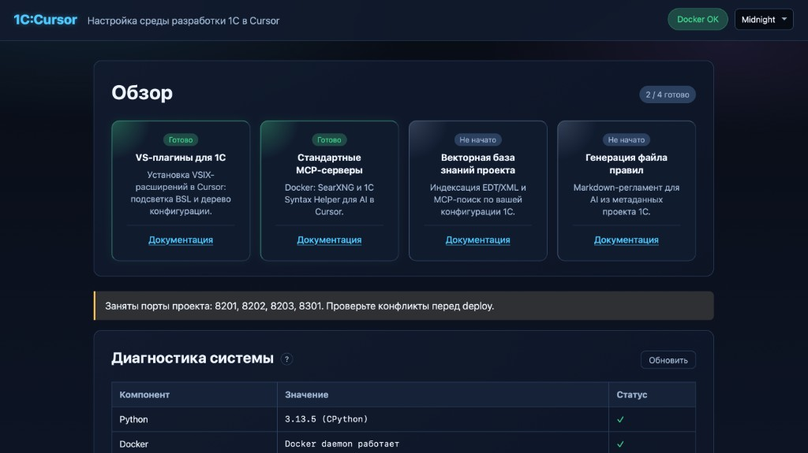

Раскройте **«Мастер первого запуска»** — он ведёт по рекомендуемому порядку. Статусы шагов обновляются автоматически.

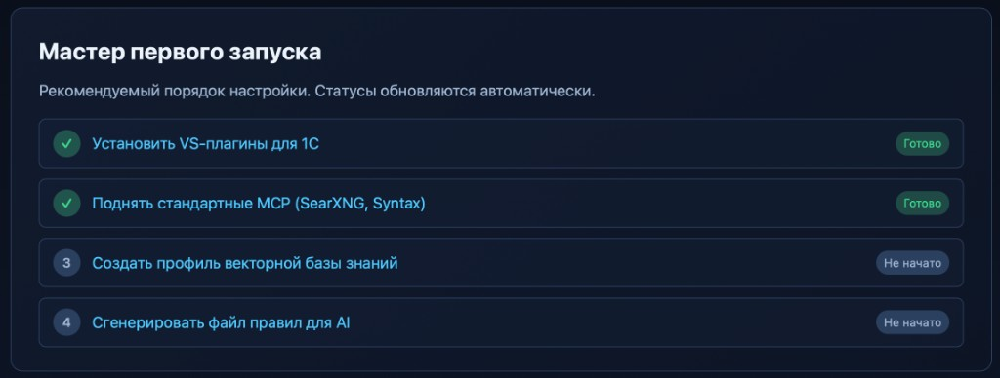

---

## 2. §1 Плагины VSIX

Перейдите в **/plugins/**. Проверьте каталог расширений Cursor (обычно определяется автоматически), отметьте оба bundled VSIX и нажмите **«Установить выбранные»**.

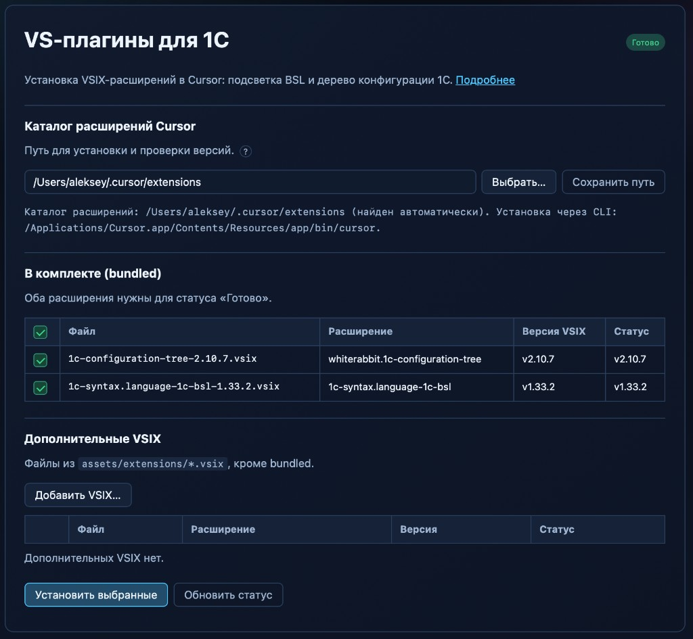

Ожидаемый результат — `OK` или `SKIP` (если уже установлено) для обоих расширений:

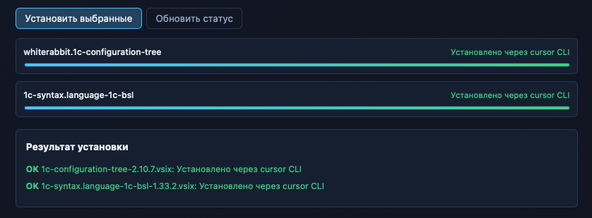

---

## 3. §2 MCP Docker

### 3.1 Корень Docker и ресурсы

На **/mcp/** в блоке **«Корень Docker»** укажите путь (по умолчанию `~/DockerMCP/`), **Выбрать…** или **Сохранить**.  
Внутри корня создаются `searxng/` и `1c-syntax/`. При смене корня каталоги compose по умолчанию обновляются; запущенные контейнеры — нет (может понадобиться Deploy).

Ниже — пресет RAM для контейнеров §2.

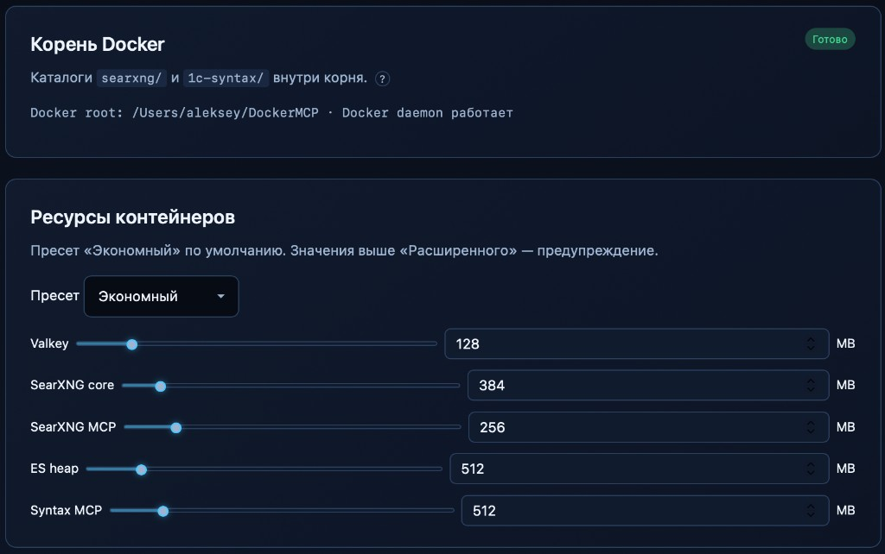

### 3.2 SearXNG и Syntax Helper

Для каждого сервера:

1. Укажите каталог compose (или оставьте стандартный).
2. Для **1C Syntax Helper** — путь к файлу **`shcntx_ru.hbk`**.
3. Нажмите **Deploy (up -d)** и дождитесь завершения.

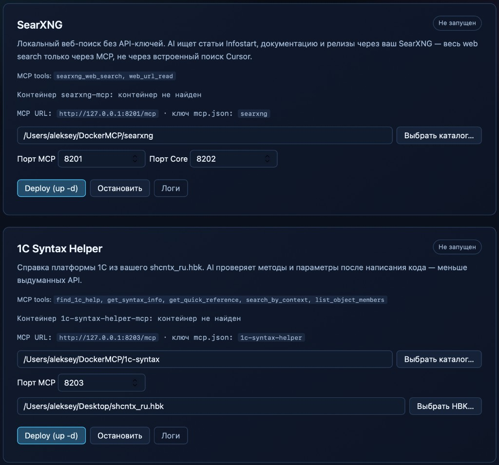

Оба сервера должны перейти в статус **«Готово»**, контейнеры — `running/healthy`:

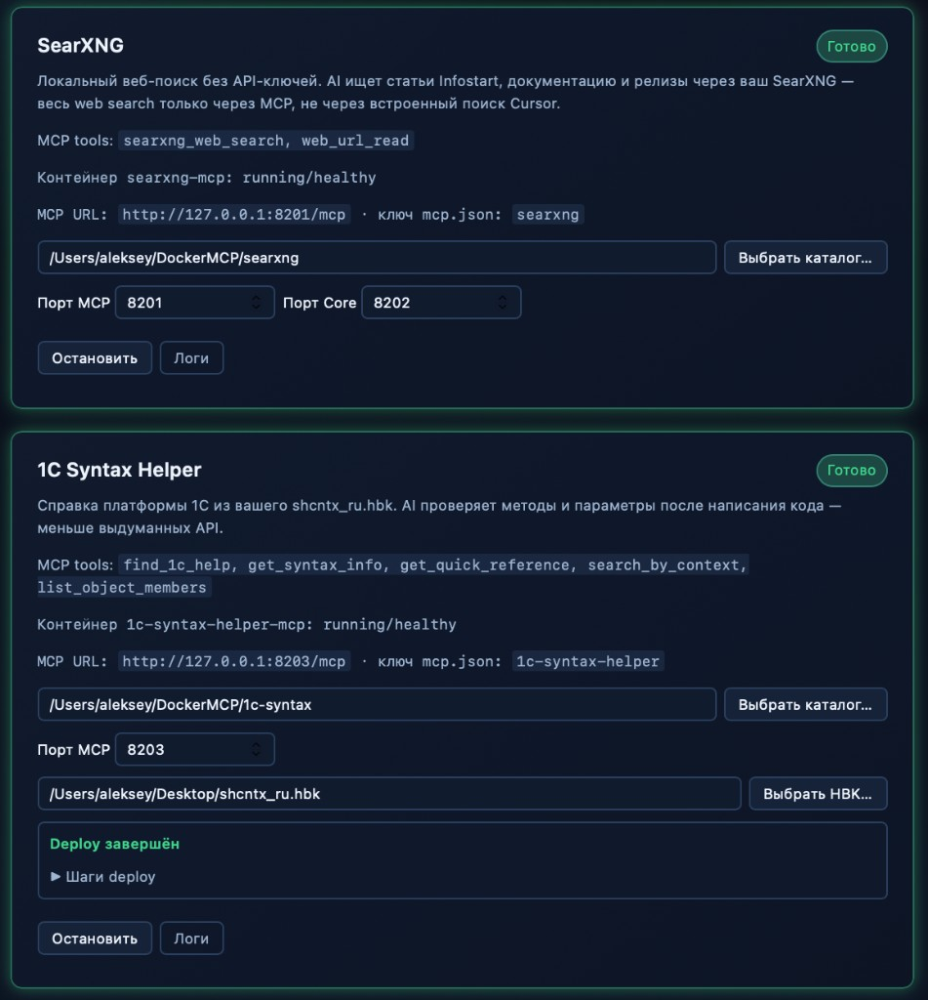

### 3.3 Запись в mcp.json

Внизу страницы §2 — блок **mcp.json**. Нажмите **Preview diff**, затем **«Применить в mcp.json»**. Сторонние MCP в файле не затираются.

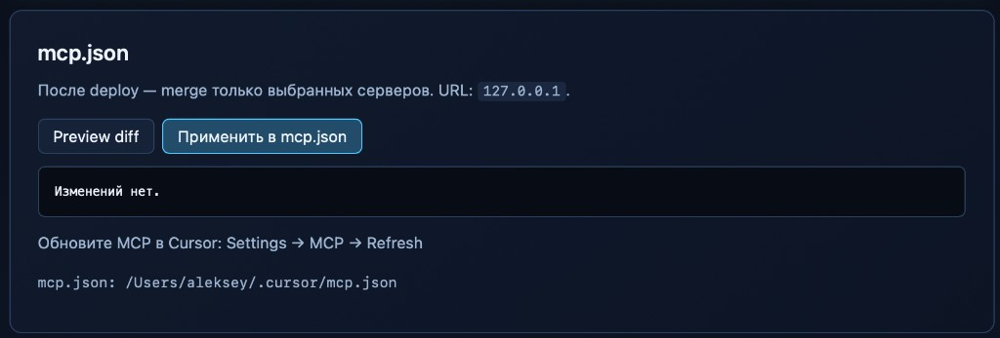

Подробнее: [05-cursor-mcp-setup.md](05-cursor-mcp-setup.md).

---

## 4. §3 База знаний

### 4.1 Новый профиль

На **/kb/** нажмите **«+ Новый профиль»**. Имя — латиницей (`my-project`), путь — к XML-выгрузке или проекту EDT.

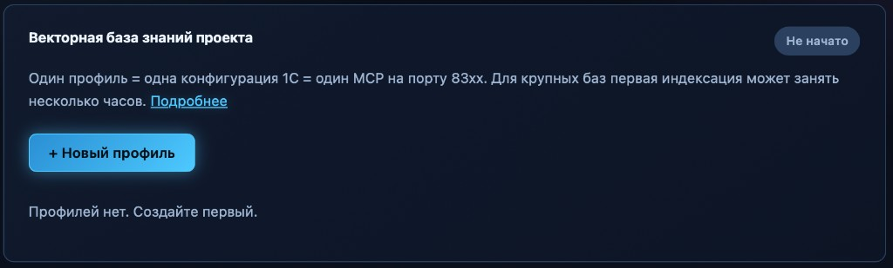

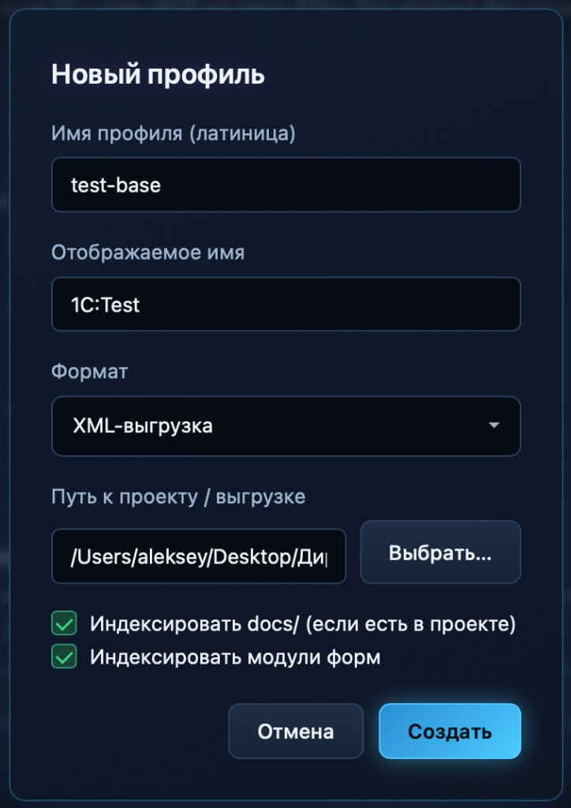

### 4.2 Индексация

На странице профиля (`/kb/profile/имя-профиля`) выполните **«Полная индексация»** (первый раз). На больших базах это может занять часы. Настройки векторизации — кнопка **⚙ Настройки** (по умолчанию: локально, `multilingual-e5-small`).

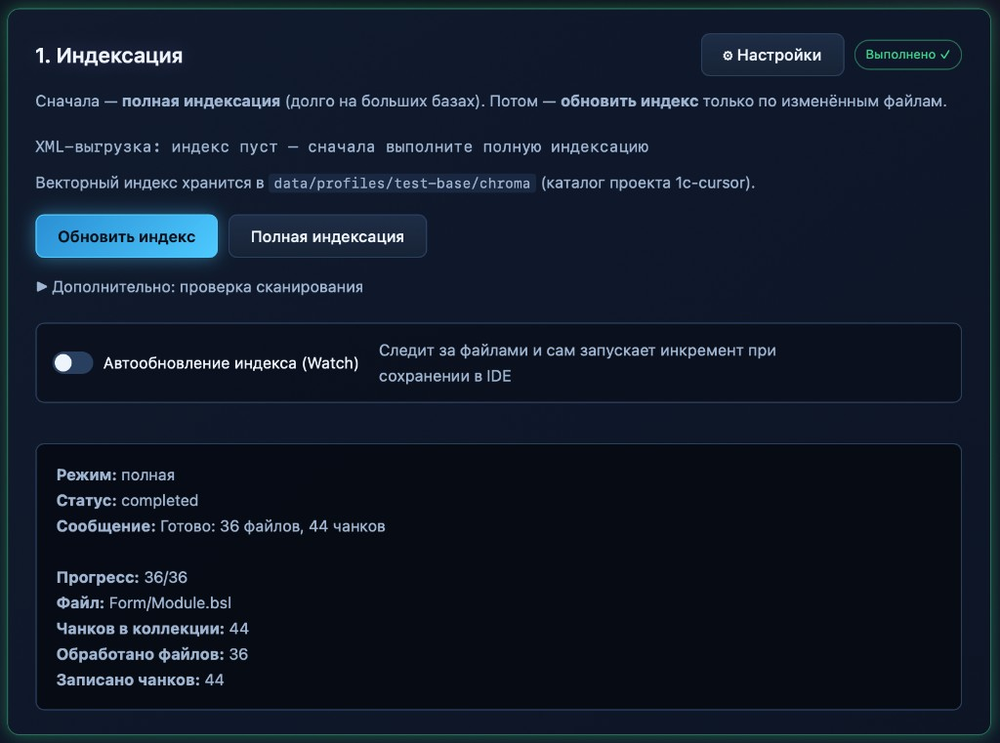

### 4.3 Docker MCP профиля

В блоке **«2. Docker MCP-сервер»** нажмите **«Запустить MCP»** — сборка образа и запуск контейнера выполняются автоматически. Порт профиля: `8300 + N` (например `8302`).

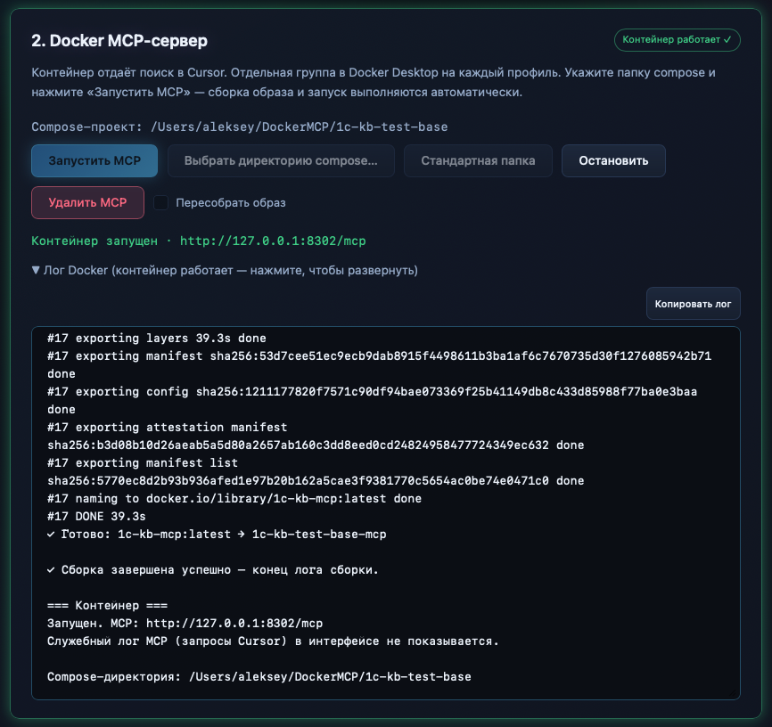

### 4.4 Подключение к Cursor

В блоке **«3. Подключение к Cursor»** включите **автообновление mcp.json** (по желанию) и нажмите **«Обновить mcp.json в Cursor»**. Статус: *«Cursor загрузил N инструмент(ов)»*.

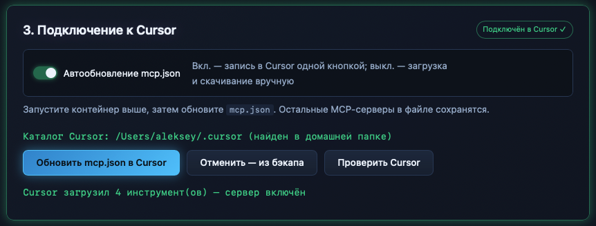

---

## 5. §4 Правила для AI

На **/rules/** укажите путь к той же выгрузке/проекту и нажмите **«Анализировать проект»**. Убедитесь, что конфигурация валидна.

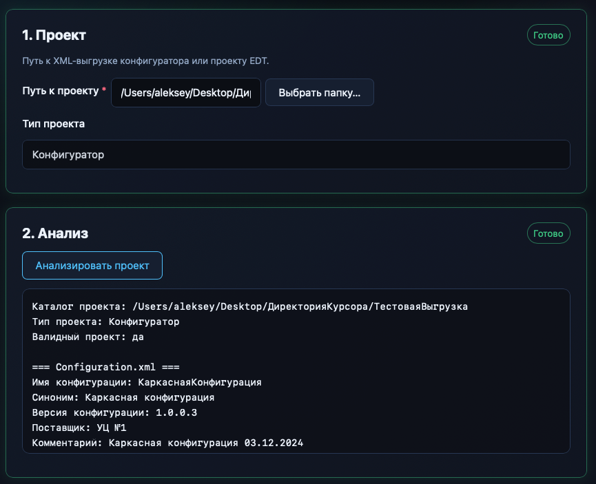

На шаге **«4. MCP в правилах»** отметьте активные серверы (`searxng`, `1c-syntax-helper`, `1c-kb-…`) и нажмите **«Принять настройки MCP»**.

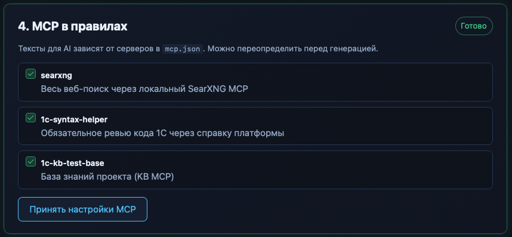

На шаге **«5. Генерация»** включите **«Записать в .cursor/rules/ проекта»** и нажмите **«Сгенерировать»**.

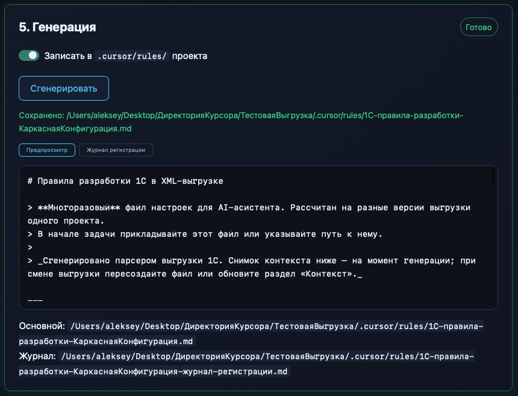

Файлы появятся в каталоге проекта:

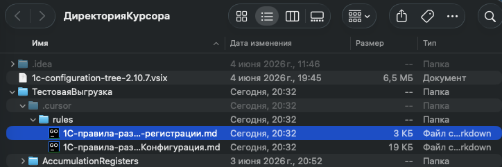

---

## 6. Финал: Refresh в Cursor

1. **Cursor** → **Settings** → **MCP** → **Refresh** (или перезапуск Cursor).
2. На dashboard нажмите **«Проверить MCP»** — все ваши серверы должны отвечать `OK`.
3. Вернитесь на dashboard: мастер и карточки §1–§4 — **«Готово»**.

Дополнительно: [01-plugins](01-plugins.md) · [02-mcp-docker](02-mcp-docker.md) · [03-knowledge-base](03-knowledge-base.md) · [04-rules-generator](04-rules-generator.md)
